# Curso: C++ con ESP32 en Wokwi - De Programación Básica a IoT

## Duración: 2 Horas y 30 Minutos | Modalidad: Práctica en Wokwi

---

## 📋 Información General

### Requisitos Previos

- ✅ Navegador web con acceso a internet
- ✅ Cuenta gratuita en Wokwi (wokwi.com)
- ✅ Conocimientos básicos de matemáticas
- ✅ Ganas de aprender programación y IoT

### Objetivos del Curso

Al finalizar este curso, los participantes serán capaces de:

- Programar ESP32 usando C++ con Arduino IDE
- Usar variables, funciones, arreglos y estructuras de control
- Distinguir entre sensores y actuadores en ESP32
- Crear circuitos básicos en el simulador Wokwi
- Controlar LEDs y leer botones con ESP32
- Usar el Monitor Serial para depuración
- Aprovechar las características únicas del ESP32 (WiFi, más pines, mayor velocidad)

### 🎯 Estructura del Curso

```
⏰ 20 min: Introducción a Wokwi y ESP32 básico
⏰ 25 min: Variables y tipos de datos con LEDs
⏰ 25 min: Estructuras de control (if/else) con sensores
⏰ 25 min: Bucles y arreglos con múltiples LEDs
⏰ 25 min: Funciones y Monitor Serial
⏰ 30 min: Proyecto integrador: Sistema IoT básico
```

---

## ⏰ SESIÓN 1: Wokwi y Conceptos Básicos del ESP32 (20 minutos)

### 1.1 Configuración de Wokwi (5 min)

**Pasos para empezar:**

1. Ir a wokwi.com
2. Crear cuenta gratuita
3. Hacer clic en "New Project"
4. Seleccionar "ESP32" como microcontrolador
5. El simulador carga automáticamente un ESP32 DevKit v1

### 1.2 Diferencias ESP32 vs Arduino Uno (5 min)

**Ventajas del ESP32:**

- **Velocidad**: 240 MHz (vs 16 MHz Arduino)
- **Memoria**: 520 KB RAM (vs 2 KB Arduino)
- **WiFi y Bluetooth**: Conectividad inalámbrica integrada
- **Más pines**: 36 pines GPIO disponibles
- **Dual core**: Procesamiento paralelo
- **ADC de 12 bits**: Lectura analógica más precisa (0-4095 vs 0-1023)

### 1.3 Estructura Básica ESP32 en C++ (5 min)

```cpp
// Estructura básica igual que Arduino
void setup() {
  // Este código se ejecuta UNA sola vez al inicio
  // Configuramos pines, WiFi, velocidad serial, etc.
}

void loop() {
  // Este código se ejecuta REPETIDAMENTE
  // Aquí va la lógica principal del programa
}
```

### 1.4 Primer Programa: LED Parpadeante ESP32 (5 min)

**Circuito en Wokwi:**

- ESP32 DevKit v1
- LED en GPIO 2 (LED integrado)

```cpp
// Mi primer programa ESP32: LED parpadeante
#define LED_PIN 2  // GPIO 2 (LED integrado en muchas placas ESP32)

void setup() {
  pinMode(LED_PIN, OUTPUT); // GPIO 2 como salida
  Serial.begin(115200);     // Velocidad más alta para ESP32
  Serial.println("ESP32 iniciado!");
}

void loop() {
  digitalWrite(LED_PIN, HIGH); // Encender LED
  Serial.println("LED ON");
  delay(1000);                 // Esperar 1 segundo

  digitalWrite(LED_PIN, LOW);  // Apagar LED
  Serial.println("LED OFF");
  delay(1000);                 // Esperar 1 segundo
}
```

**💡 Conceptos importantes del ESP32:**

- Los pines se nombran como GPIO (GPIO0, GPIO2, GPIO4, etc.)
- Velocidad serial típica: 115200 bps (más rápida que Arduino)
- Algunos pines tienen funciones especiales (solo lectura, solo arranque, etc.)

**🔧 Ejercicio:** Cambia el LED al GPIO 4 y modifica los delays para parpadeo más rápido (200ms).

---

## ⏰ SESIÓN 2: Variables y Tipos de Datos con ESP32 (25 minutos)

### 2.1 Actuadores en ESP32 (5 min)

**Actuadores compatibles con ESP32:**

- **LEDs**: Control básico de iluminación
- **LEDs RGB**: Control de color con PWM
- **Motores DC**: Con mayor corriente disponible
- **Servomotores**: Control preciso de posición
- **Displays OLED**: Comunicación I2C/SPI
- **Relés**: Control de cargas de alta potencia

### 2.2 Variables Básicas con LEDs RGB (10 min)

**Circuito en Wokwi:** ESP32 + LED RGB en pines GPIO 16, 17, 18

```cpp
// Variables para LED RGB
int ledRojo = 16;    // GPIO 16 para rojo
int ledVerde = 17;   // GPIO 17 para verde
int ledAzul = 18;    // GPIO 18 para azul

int brillo = 128;    // Brillo medio (0-255)
int velocidad = 800; // Velocidad de cambio en ms
bool cicloActivo = true;

void setup() {
  // Configurar pines como salida
  pinMode(ledRojo, OUTPUT);
  pinMode(ledVerde, OUTPUT);
  pinMode(ledAzul, OUTPUT);

  Serial.begin(115200);
  Serial.println("=== Control LED RGB ESP32 ===");
  Serial.println("Rojo -> Verde -> Azul -> Ciclo");
}

void loop() {
  if (cicloActivo) {
    // Rojo
    analogWrite(ledRojo, brillo);
    analogWrite(ledVerde, 0);
    analogWrite(ledAzul, 0);
    Serial.println("Color: ROJO");
    delay(velocidad);

    // Verde
    analogWrite(ledRojo, 0);
    analogWrite(ledVerde, brillo);
    analogWrite(ledAzul, 0);
    Serial.println("Color: VERDE");
    delay(velocidad);

    // Azul
    analogWrite(ledRojo, 0);
    analogWrite(ledVerde, 0);
    analogWrite(ledAzul, brillo);
    Serial.println("Color: AZUL");
    delay(velocidad);

    // Magenta (mezcla)
    analogWrite(ledRojo, brillo);
    analogWrite(ledVerde, 0);
    analogWrite(ledAzul, brillo);
    Serial.println("Color: MAGENTA");
    delay(velocidad);
  }
}
```

### 2.3 Tipos de Variables Específicos para ESP32 (10 min)

```cpp
// Variables específicas para ESP32
#include <WiFi.h>
#include <String.h>

// Tipos básicos (iguales que Arduino)
int temperatura = 25;
float voltaje = 3.3;        // ESP32 usa 3.3V lógico
bool wifiConectado = false;
char buffer[50];
String nombreRed = "MiWiFi";

// Variables para pines GPIO
const int PIN_LED = 2;
const int PIN_BOTON = 4;
const int PIN_SENSOR = 34;  // Solo GPIO 32-39 para ADC

// Variables para configuración WiFi
const char* ssid = "MiRed";
const char* password = "MiPassword";

// Variables de tiempo (útiles para ESP32)
unsigned long tiempoAnterior = 0;
unsigned long intervalo = 5000; // 5 segundos

void setup() {
  Serial.begin(115200);

  // Configurar pines
  pinMode(PIN_LED, OUTPUT);
  pinMode(PIN_BOTON, INPUT_PULLUP); // Pull-up interno

  // Mostrar información del ESP32
  Serial.println("\n=== Información del ESP32 ===");
  Serial.print("Chip ID: ");
  Serial.println(ESP.getChipRevision());
  Serial.print("Frecuencia CPU: ");
  Serial.print(ESP.getCpuFreqMHz());
  Serial.println(" MHz");
  Serial.print("Memoria libre: ");
  Serial.print(ESP.getFreeHeap());
  Serial.println(" bytes");

  // Mostrar variables
  Serial.println("\n=== Variables ===");
  Serial.print("Temperatura: ");
  Serial.print(temperatura);
  Serial.println("°C");
  Serial.print("Voltaje lógico: ");
  Serial.print(voltaje);
  Serial.println("V");
  Serial.print("Red WiFi: ");
  Serial.println(nombreRed);
}

void loop() {
  unsigned long tiempoActual = millis();

  // Leer botón
  bool estadoBoton = !digitalRead(PIN_BOTON); // Invertido por pull-up

  if (estadoBoton) {
    digitalWrite(PIN_LED, HIGH);
    Serial.println("Botón presionado - LED ON");
  } else {
    digitalWrite(PIN_LED, LOW);
  }

  // Mostrar información cada 5 segundos
  if (tiempoActual - tiempoAnterior >= intervalo) {
    tiempoAnterior = tiempoActual;

    Serial.println("\n=== Estado del Sistema ===");
    Serial.print("Tiempo funcionando: ");
    Serial.print(millis() / 1000);
    Serial.println(" segundos");
    Serial.print("Memoria libre: ");
    Serial.print(ESP.getFreeHeap());
    Serial.println(" bytes");
  }

  delay(100);
}
```

**💡 Características únicas del ESP32:**

- **Voltaje lógico**: 3.3V (no 5V como Arduino Uno)
- **INPUT_PULLUP**: Resistencias pull-up internas disponibles
- **Funciones ESP**: ESP.getChipRevision(), ESP.getFreeHeap(), etc.
- **Pines ADC**: Solo GPIO 32-39 para lectura analógica

**🔧 Ejercicio:** Crea un programa que use 4 LEDs en diferentes pines GPIO y controle su brillo con PWM (analogWrite).

---

## ⏰ SESIÓN 3: Sensores y Estructuras de Control (25 minutos)

### 3.1 Sensores Compatibles con ESP32 (5 min)

**Sensores digitales:**

- **Botones**: Detección táctil
- **Reed switch**: Detección magnética
- **PIR**: Detección de movimiento
- **DHT22**: Temperatura y humedad digital

**Sensores analógicos (ADC 12-bit: 0-4095):**

- **Potenciómetro**: Posición rotacional
- **LDR**: Intensidad lumínica
- **NTC**: Temperatura analógica
- **Sensores de gas**: MQ-series

### 3.2 Botón Touch Capacitivo ESP32 (10 min)

**Circuito en Wokwi:** ESP32 + Cable en GPIO 4 (sensor touch) + LED en GPIO 2

```cpp
// Variables para sensor touch y LED
const int TOUCH_PIN = 4;    // GPIO 4 como sensor touch
const int LED_PIN = 2;      // GPIO 2 para LED
const int UMBRAL_TOUCH = 20; // Umbral de sensibilidad

int valorTouch = 0;
bool ledEncendido = false;
bool estadoAnterior = false;

void setup() {
  pinMode(LED_PIN, OUTPUT);
  Serial.begin(115200);
  Serial.println("=== Sensor Touch ESP32 ===");
  Serial.println("Toca el cable conectado al GPIO 4");
  Serial.print("Umbral configurado: ");
  Serial.println(UMBRAL_TOUCH);
}

void loop() {
  // Leer valor del sensor touch (menor valor = más presión)
  valorTouch = touchRead(TOUCH_PIN);

  // Detectar toque
  bool tocando = (valorTouch < UMBRAL_TOUCH);

  // Cambiar estado solo en flanco de bajada
  if (tocando && !estadoAnterior) {
    ledEncendido = !ledEncendido;
    digitalWrite(LED_PIN, ledEncendido);

    Serial.print("¡Toque detectado! Valor: ");
    Serial.print(valorTouch);
    Serial.print(" - LED: ");
    Serial.println(ledEncendido ? "ON" : "OFF");
  }

  estadoAnterior = tocando;

  // Mostrar valor cada segundo para calibración
  static unsigned long ultimoMuestreo = 0;
  if (millis() - ultimoMuestreo > 1000) {
    Serial.print("Valor touch actual: ");
    Serial.print(valorTouch);
    Serial.println(tocando ? " (TOCANDO)" : " (LIBRE)");
    ultimoMuestreo = millis();
  }

  delay(50);
}
```

### 3.3 Sistema de Alarma con Múltiples Sensores (10 min)

**Circuito:** ESP32 + Botón en GPIO 21 + Potenciómetro en GPIO 34 + LEDs en GPIO 16, 17, 18

```cpp
// Sistema de alarma inteligente
const int BOTON_ARMAR = 21;      // Botón para armar/desarmar
const int SENSOR_LUZ = 34;       // Potenciómetro como sensor de luz
const int LED_VERDE = 16;        // Sistema desarmado
const int LED_AMARILLO = 17;     // Sistema armado
const int LED_ROJO = 18;         // Alarma activada

// Estados del sistema
enum EstadoAlarma {
  DESARMADO,
  ARMADO,
  ALARMA_ACTIVA
};

EstadoAlarma estadoActual = DESARMADO;
int nivelLuzBase = 0;
const int SENSIBILIDAD = 500;    // Cambio mínimo para activar alarma
bool botonAnterior = true;       // Pull-up activo

void setup() {
  pinMode(BOTON_ARMAR, INPUT_PULLUP);
  pinMode(LED_VERDE, OUTPUT);
  pinMode(LED_AMARILLO, OUTPUT);
  pinMode(LED_ROJO, OUTPUT);

  Serial.begin(115200);
  Serial.println("=== Sistema de Alarma ESP32 ===");

  // Calibrar sensor de luz inicial
  delay(2000);
  nivelLuzBase = analogRead(SENSOR_LUZ);
  Serial.print("Nivel de luz base calibrado: ");
  Serial.println(nivelLuzBase);

  // Estado inicial
  cambiarEstado(DESARMADO);
}

void loop() {
  // Leer entradas
  bool botonPresionado = !digitalRead(BOTON_ARMAR);
  int nivelLuzActual = analogRead(SENSOR_LUZ);

  // Detectar cambio de botón (edge detection)
  if (botonPresionado && botonAnterior) {
    manejarBoton();
    delay(300); // Anti-rebote
  }
  botonAnterior = !botonPresionado;

  // Lógica según estado actual
  switch (estadoActual) {
    case DESARMADO:
      // No hacer nada, sistema inactivo
      break;

    case ARMADO:
      // Verificar si hay cambio significativo en luz
      if (abs(nivelLuzActual - nivelLuzBase) > SENSIBILIDAD) {
        Serial.println("¡INTRUSO DETECTADO!");
        Serial.print("Luz base: ");
        Serial.print(nivelLuzBase);
        Serial.print(" | Luz actual: ");
        Serial.println(nivelLuzActual);
        cambiarEstado(ALARMA_ACTIVA);
      }
      break;

    case ALARMA_ACTIVA:
      // LED rojo parpadeante
      digitalWrite(LED_ROJO, !digitalRead(LED_ROJO));
      delay(200);
      break;
  }

  delay(100);
}

void manejarBoton() {
  switch (estadoActual) {
    case DESARMADO:
      cambiarEstado(ARMADO);
      // Recalibrar sensor
      nivelLuzBase = analogRead(SENSOR_LUZ);
      Serial.print("Sistema ARMADO - Nueva base de luz: ");
      Serial.println(nivelLuzBase);
      break;

    case ARMADO:
      cambiarEstado(DESARMADO);
      Serial.println("Sistema DESARMADO");
      break;

    case ALARMA_ACTIVA:
      cambiarEstado(DESARMADO);
      Serial.println("Alarma DESACTIVADA");
      break;
  }
}

void cambiarEstado(EstadoAlarma nuevoEstado) {
  estadoActual = nuevoEstado;

  // Apagar todos los LEDs
  digitalWrite(LED_VERDE, LOW);
  digitalWrite(LED_AMARILLO, LOW);
  digitalWrite(LED_ROJO, LOW);

  // Encender LED correspondiente
  switch (estadoActual) {
    case DESARMADO:
      digitalWrite(LED_VERDE, HIGH);
      break;
    case ARMADO:
      digitalWrite(LED_AMARILLO, HIGH);
      break;
    case ALARMA_ACTIVA:
      // El LED rojo se maneja en el loop principal
      break;
  }
}
```

**🔧 Ejercicio:** Agrega un segundo sensor (otro potenciómetro) que detecte cambios de temperatura y también pueda activar la alarma.

---

## ⏰ SESIÓN 4: Bucles y Arreglos con ESP32 (25 minutos)

### 4.1 Bucle FOR con Múltiples LEDs (10 min)

**Circuito:** ESP32 + 8 LEDs en GPIO 12, 13, 14, 15, 16, 17, 18, 19

```cpp
// Control de múltiples LEDs con ESP32
const int NUM_LEDS = 8;
int leds[NUM_LEDS] = {12, 13, 14, 15, 16, 17, 18, 19};

// Patrones de LEDs
bool patron1[NUM_LEDS] = {1, 0, 1, 0, 1, 0, 1, 0}; // Alternado
bool patron2[NUM_LEDS] = {1, 1, 0, 0, 1, 1, 0, 0}; // Pares
bool patron3[NUM_LEDS] = {1, 1, 1, 1, 0, 0, 0, 0}; // Mitades

int patronActual = 0;
const int NUM_PATRONES = 3;

void setup() {
  Serial.begin(115200);
  Serial.println("=== Control Múltiples LEDs ESP32 ===");

  // Configurar todos los LEDs como salida
  for (int i = 0; i < NUM_LEDS; i++) {
    pinMode(leds[i], OUTPUT);
    Serial.print("LED ");
    Serial.print(i + 1);
    Serial.print(" configurado en GPIO ");
    Serial.println(leds[i]);
  }

  Serial.println("Patrones disponibles:");
  Serial.println("0: Alternado");
  Serial.println("1: Pares");
  Serial.println("2: Mitades");
  Serial.println("3: Secuencial");
  Serial.println("4: Contador binario");
}

void loop() {
  switch (patronActual) {
    case 0: // Alternado
      aplicarPatron(patron1);
      break;

    case 1: // Pares
      aplicarPatron(patron2);
      break;

    case 2: // Mitades
      aplicarPatron(patron3);
      break;

    case 3: // Secuencial
      patronSecuencial();
      break;

    case 4: // Contador binario
      patronContador();
      break;
  }

  // Cambiar patrón cada 5 segundos
  static unsigned long ultimoCambio = 0;
  if (millis() - ultimoCambio > 5000) {
    patronActual = (patronActual + 1) % 5;
    Serial.print("Cambiando a patrón: ");
    Serial.println(patronActual);
    ultimoCambio = millis();
    apagarTodos(); // Limpiar antes del cambio
    delay(500);
  }
}

void aplicarPatron(bool patron[]) {
  for (int i = 0; i < NUM_LEDS; i++) {
    digitalWrite(leds[i], patron[i]);
  }
  delay(1000);

  // Invertir patrón
  for (int i = 0; i < NUM_LEDS; i++) {
    digitalWrite(leds[i], !patron[i]);
  }
  delay(1000);
}

void patronSecuencial() {
  // Encender uno por uno
  for (int i = 0; i < NUM_LEDS; i++) {
    digitalWrite(leds[i], HIGH);
    Serial.print("LED ");
    Serial.print(i + 1);
    Serial.println(" ON");
    delay(200);
  }

  // Apagar uno por uno (reversa)
  for (int i = NUM_LEDS - 1; i >= 0; i--) {
    digitalWrite(leds[i], LOW);
    Serial.print("LED ");
    Serial.print(i + 1);
    Serial.println(" OFF");
    delay(200);
  }
}

void patronContador() {
  // Mostrar números del 0 al 255 en binario
  for (int numero = 0; numero < 256; numero++) {
    Serial.print("Número binario: ");
    Serial.print(numero);
    Serial.print(" = ");

    for (int bit = 0; bit < NUM_LEDS; bit++) {
      bool estado = (numero >> bit) & 1;
      digitalWrite(leds[bit], estado);
      Serial.print(estado);
    }
    Serial.println();
    delay(300);
  }
}

void apagarTodos() {
  for (int i = 0; i < NUM_LEDS; i++) {
    digitalWrite(leds[i], LOW);
  }
}
```

### 4.2 Bucle WHILE con Sensor Analógico (8 min)

```cpp
// Control de velocidad basado en sensor
const int SENSOR_PIN = 34;      // GPIO 34 (ADC)
const int LED_PIN = 2;          // LED indicador
const int BOTON_INICIO = 21;    // Botón para iniciar secuencia

int leds[] = {12, 13, 14, 15, 16, 17, 18, 19};
const int NUM_LEDS = 8;

void setup() {
  pinMode(LED_PIN, OUTPUT);
  pinMode(BOTON_INICIO, INPUT_PULLUP);

  for (int i = 0; i < NUM_LEDS; i++) {
    pinMode(leds[i], OUTPUT);
  }

  Serial.begin(115200);
  Serial.println("=== Control Velocidad Variable ===");
  Serial.println("Gira el potenciómetro para cambiar velocidad");
  Serial.println("Presiona el botón para iniciar secuencia");
}

void loop() {
  // Esperar hasta que se presione el botón
  Serial.println("Esperando botón de inicio...");
  digitalWrite(LED_PIN, HIGH);

  while (digitalRead(BOTON_INICIO) == HIGH) {
    // Mostrar valor del sensor mientras esperamos
    int valorSensor = analogRead(SENSOR_PIN);
    int velocidad = map(valorSensor, 0, 4095, 50, 1000);

    Serial.print("Velocidad configurada: ");
    Serial.print(velocidad);
    Serial.println(" ms");

    delay(500);
  }

  digitalWrite(LED_PIN, LOW);
  Serial.println("¡Iniciando secuencia!");

  // Ejecutar secuencia con velocidad variable
  unsigned long tiempoInicio = millis();
  while (millis() - tiempoInicio < 10000) { // 10 segundos de secuencia
    int valorSensor = analogRead(SENSOR_PIN);
    int velocidad = map(valorSensor, 0, 4095, 50, 1000);

    // Secuencia de LEDs
    for (int i = 0; i < NUM_LEDS; i++) {
      // Verificar si se cambió la velocidad
      int nuevoValor = analogRead(SENSOR_PIN);
      if (abs(nuevoValor - valorSensor) > 100) {
        velocidad = map(nuevoValor, 0, 4095, 50, 1000);
        Serial.print("Velocidad cambiada a: ");
        Serial.print(velocidad);
        Serial.println(" ms");
      }

      digitalWrite(leds[i], HIGH);
      delay(velocidad / 2);
      digitalWrite(leds[i], LOW);
      delay(velocidad / 2);
    }
  }

  Serial.println("Secuencia completada");
  delay(1000);
}
```

### 4.3 Promedio Móvil con Arreglos (7 min)

```cpp
// Filtro de promedio móvil para sensor analógico
const int SENSOR_PIN = 34;
const int LED_PIN = 2;
const int VENTANA = 20;         // Tamaño de ventana para promedio

int lecturas[VENTANA];          // Arreglo para almacenar lecturas
int indice = 0;                 // Índice actual
int suma = 0;                   // Suma total
int promedio = 0;               // Promedio calculado

void setup() {
  pinMode(LED_PIN, OUTPUT);
  Serial.begin(115200);
  Serial.println("=== Filtro Promedio Móvil ESP32 ===");

  // Inicializar arreglo en ceros
  for (int i = 0; i < VENTANA; i++) {
    lecturas[i] = 0;
  }

  Serial.print("Ventana de promedio: ");
  Serial.print(VENTANA);
  Serial.println(" muestras");
}

void loop() {
  // Leer nuevo valor del sensor
  int valorActual = analogRead(SENSOR_PIN);

  // Quitar el valor más antiguo de la suma
  suma -= lecturas[indice];

  // Agregar el nuevo valor
  lecturas[indice] = valorActual;
  suma += valorActual;

  // Calcular promedio
  promedio = suma / VENTANA;

  // Avanzar índice (circular)
  indice = (indice + 1) % VENTANA;

  // Mostrar resultados
  Serial.print("Valor actual: ");
  Serial.print(valorActual);
  Serial.print(" | Promedio: ");
  Serial.print(promedio);
  Serial.print(" | Diferencia: ");
  Serial.println(abs(valorActual - promedio));

  // Controlar LED basado en estabilidad
  if (abs(valorActual - promedio) < 50) {
    digitalWrite(LED_PIN, HIGH); // Señal estable
  } else {
    digitalWrite(LED_PIN, LOW);  // Señal inestable
  }

  // Mostrar gráfico simple en Serial
  mostrarGrafico(promedio);

  delay(100);
}

void mostrarGrafico(int valor) {
  // Mapear valor a barras de 0-50 caracteres
  int barras = map(valor, 0, 4095, 0, 50);

  Serial.print("|");
  for (int i = 0; i < 50; i++) {
    if (i < barras) {
      Serial.print("█");
    } else {
      Serial.print("░");
    }
  }
  Serial.print("| ");
  Serial.print(valor);
  Serial.println();
}
```

**🔧 Ejercicio:** Crea un programa que use dos potenciómetros: uno para controlar la velocidad de una secuencia de LEDs y otro para controlar el brillo (usando PWM).

---

## ⏰ SESIÓN 5: Funciones y Monitor Serial Avanzado (25 minutos)

### 5.1 Funciones Específicas para ESP32 (10 min)

```cpp
// Funciones avanzadas para ESP32
#include <WiFi.h>

const int LED_STATUS = 2;
const int LED_WIFI = 4;
const int BUZZER_PIN = 5;

// Variables globales
String nombreDispositivo = "ESP32-Curso";
unsigned long tiempoInicio;

void setup() {
  Serial.begin(115200);
  tiempoInicio = millis();

  configurarPines();
  mostrarInfoSistema();
  inicializarWiFi();

  Serial.println("\n=== Sistema Iniciado ===");
  tocarMelodia();
}

void loop() {
  static unsigned long ultimoReporte = 0;

  if (millis() - ultimoReporte > 5000) {
    reporteEstado();
    ultimoReporte = millis();
  }

  // Parpadear LED de estado cada segundo
  parpadearLED(LED_STATUS, 1000);

  delay(100);
}

// Función para configurar todos los pines
void configurarPines() {
  pinMode(LED_STATUS, OUTPUT);
  pinMode(LED_WIFI, OUTPUT);
  pinMode(BUZZER_PIN, OUTPUT);

  Serial.println("Pines configurados correctamente");
}

// Función para mostrar información del sistema
void mostrarInfoSistema() {
  Serial.println("\n=== Información del ESP32 ===");
  Serial.print("Nombre: ");
  Serial.println(nombreDispositivo);
  Serial.print("Chip Model: ");
  Serial.println(ESP.getChipModel());
  Serial.print("Chip Revision: ");
  Serial.println(ESP.getChipRevision());
  Serial.print("CPU Frequency: ");
  Serial.print(ESP.getCpuFreqMHz());
  Serial.println(" MHz");
  Serial.print("Flash Size: ");
  Serial.print(ESP.getFlashChipSize() / 1024 / 1024);
  Serial.println(" MB");
  Serial.print("Free Heap: ");
  Serial.print(ESP.getFreeHeap());
  Serial.println(" bytes");
  Serial.print("SDK Version: ");
  Serial.println(ESP.getSdkVersion());
}

// Función para inicializar WiFi (simulado en Wokwi)
void inicializarWiFi() {
  Serial.println("\n=== Configuración WiFi ===");
  Serial.println("Modo simulación - WiFi no disponible en Wokwi");

  // Simular proceso de conexión
  Serial.print("Conectando");
  for (int i = 0; i < 5; i++) {
    Serial.print(".");
    digitalWrite(LED_WIFI, HIGH);
    delay(200);
    digitalWrite(LED_WIFI, LOW);
    delay(200);
  }

  Serial.println("\nWiFi simulado - LED WiFi encendido");
  digitalWrite(LED_WIFI, HIGH);
}

// Función para hacer parpadear LED con timing específico
void parpadearLED(int pin, unsigned long intervalo) {
  static unsigned long ultimoCambio = 0;
  static bool estado = false;

  if (millis() - ultimoCambio >= intervalo) {
    estado = !estado;
    digitalWrite(pin, estado);
    ultimoCambio = millis();
  }
}

// Función para tocar melodía simple
void tocarMelodia() {
  int notas[] = {262, 294, 330, 349, 392, 440, 494, 523}; // Do, Re, Mi, Fa, Sol, La, Si, Do
  int duracion[] = {250, 250, 250, 250, 250, 250, 250, 500};

  Serial.println("Tocando melodía de inicio...");

  for (int i = 0; i < 8; i++) {
    tone(BUZZER_PIN, notas[i], duracion[i]);
    delay(duracion[i] + 50);
  }

  noTone(BUZZER_PIN);
  Serial.println("Melodía completada");
}

// Función para reportar estado del sistema
void reporteEstado() {
  unsigned long tiempoFuncionamiento = millis() - tiempoInicio;

  Serial.println("\n=== Reporte de Estado ===");
  Serial.print("Tiempo funcionando: ");
  Serial.print(tiempoFuncionamiento / 1000);
  Serial.println(" segundos");
  Serial.print("Memoria libre: ");
  Serial.print(ESP.getFreeHeap());
  Serial.println(" bytes");
  Serial.print("Temperatura interna: ");
  Serial.print(temperatureRead(), 1);
  Serial.println("°C");

  // Mostrar estado de los pines
  Serial.println("Estado de LEDs:");
  Serial.print("  - LED Status: ");
  Serial.println(digitalRead(LED_STATUS) ? "ON" : "OFF");
  Serial.print("  - LED WiFi: ");
  Serial.println(digitalRead(LED_WIFI) ? "ON" : "OFF");
}

// Función para convertir ADC a voltaje (ESP32 usa 3.3V)
float adcAVoltaje(int valorADC) {
  return (valorADC * 3.3) / 4095.0;
}

// Función para mapear valores con decimales
float mapFloat(float valor, float minEntrada, float maxEntrada, float minSalida, float maxSalida) {
  return (valor - minEntrada) * (maxSalida - minSalida) / (maxEntrada - minEntrada) + minSalida;
}
```

### 5.2 Monitor Serial Interactivo con Menús (8 min)

```cpp
// Sistema de menú interactivo por Serial
const int LED_PINS[] = {12, 13, 14, 15};
const int NUM_LEDS = 4;
const int SENSOR_PIN = 34;

bool sistemaBloqueado = false;
String password = "1234";
String inputBuffer = "";

void setup() {
  Serial.begin(115200);

  // Configurar LEDs
  for (int i = 0; i < NUM_LEDS; i++) {
    pinMode(LED_PINS[i], OUTPUT);
  }

  Serial.println("\n=== Sistema de Control ESP32 ===");
  Serial.println("Ingresa la contraseña para acceder:");
  Serial.print("Password: ");
}

void loop() {
  // Leer comandos del Serial
  if (Serial.available() > 0) {
    String comando = Serial.readStringUntil('\n');
    comando.trim();

    if (sistemaBloqueado) {
      verificarPassword(comando);
    } else {
      procesarComando(comando);
    }
  }

  // Actualizar sensor cada segundo
  static unsigned long ultimaLectura = 0;
  if (millis() - ultimaLectura > 1000 && !sistemaBloqueado) {
    int valorSensor = analogRead(SENSOR_PIN);
    float voltaje = adcAVoltaje(valorSensor);

    Serial.print("Sensor: ");
    Serial.print(valorSensor);
    Serial.print(" (");
    Serial.print(voltaje, 2);
    Serial.println("V)");

    ultimaLectura = millis();
  }
}

void verificarPassword(String input) {
  if (input == password) {
    sistemaBloqueado = false;
    Serial.println("✓ Acceso concedido");
    mostrarMenu();
  } else {
    Serial.println("✗ Contraseña incorrecta");
    Serial.print("Password: ");
  }
}

void mostrarMenu() {
  Serial.println("\n=== MENÚ PRINCIPAL ===");
  Serial.println("1. Control de LEDs");
  Serial.println("2. Información del sistema");
  Serial.println("3. Configurar sensor");
  Serial.println("4. Patrones automáticos");
  Serial.println("5. Cambiar contraseña");
  Serial.println("6. Bloquear sistema");
  Serial.println("help - Mostrar este menú");
  Serial.println("Ingresa comando:");
}

void procesarComando(String cmd) {
  cmd.toLowerCase();

  if (cmd == "1" || cmd == "leds") {
    menuLEDs();
  } else if (cmd == "2" || cmd == "info") {
    mostrarInfoSistema();
    mostrarMenu();
  } else if (cmd == "3" || cmd == "sensor") {
    configurarSensor();
  } else if (cmd == "4" || cmd == "patrones") {
    ejecutarPatrones();
  } else if (cmd == "5" || cmd == "password") {
    cambiarPassword();
  } else if (cmd == "6" || cmd == "lock") {
    sistemaBloqueado = true;
    Serial.println("Sistema bloqueado. Ingresa contraseña:");
  } else if (cmd == "help") {
    mostrarMenu();
  } else {
    Serial.println("Comando no reconocido. Escribe 'help' para ver opciones.");
  }
}

void menuLEDs() {
  Serial.println("\n=== Control de LEDs ===");
  Serial.println("on [1-4] - Encender LED específico");
  Serial.println("off [1-4] - Apagar LED específico");
  Serial.println("toggle [1-4] - Cambiar estado LED");
  Serial.println("all on/off - Todos los LEDs");
  Serial.println("back - Volver al menú principal");

  while (true) {
    if (Serial.available() > 0) {
      String cmd = Serial.readStringUntil('\n');
      cmd.trim();
      cmd.toLowerCase();

      if (cmd == "back") {
        mostrarMenu();
        break;
      } else if (cmd.startsWith("on ")) {
        int led = cmd.substring(3).toInt() - 1;
        if (led >= 0 && led < NUM_LEDS) {
          digitalWrite(LED_PINS[led], HIGH);
          Serial.println("LED " + String(led + 1) + " encendido");
        }
      } else if (cmd.startsWith("off ")) {
        int led = cmd.substring(4).toInt() - 1;
        if (led >= 0 && led < NUM_LEDS) {
          digitalWrite(LED_PINS[led], LOW);
          Serial.println("LED " + String(led + 1) + " apagado");
        }
      } else if (cmd == "all on") {
        for (int i = 0; i < NUM_LEDS; i++) {
          digitalWrite(LED_PINS[i], HIGH);
        }
        Serial.println("Todos los LEDs encendidos");
      } else if (cmd == "all off") {
        for (int i = 0; i < NUM_LEDS; i++) {
          digitalWrite(LED_PINS[i], LOW);
        }
        Serial.println("Todos los LEDs apagados");
      }
    }
  }
}

void cambiarPassword() {
  Serial.println("Ingresa nueva contraseña:");
  while (!Serial.available()) {}

  String nuevaPassword = Serial.readStringUntil('\n');
  nuevaPassword.trim();

  if (nuevaPassword.length() >= 4) {
    password = nuevaPassword;
    Serial.println("Contraseña cambiada exitosamente");
  } else {
    Serial.println("La contraseña debe tener al menos 4 caracteres");
  }

  mostrarMenu();
}
```

### 5.3 Funciones de Utilidad Avanzadas (7 min)

```cpp
// Librería de funciones utilitarias para ESP32
#include <math.h>

// Función para crear efecto de respiración en LED
void efectoRespiracion(int pin, int duracion = 2000) {
  Serial.println("Iniciando efecto respiración...");

  unsigned long inicio = millis();
  while (millis() - inicio < duracion) {
    float tiempo = (millis() - inicio) / (float)duracion;
    float brillo = (sin(tiempo * 2 * PI) + 1) / 2; // Seno normalizado 0-1

    int pwm = brillo * 255;
    analogWrite(pin, pwm);

    delay(20);
  }

  digitalWrite(pin, LOW);
  Serial.println("Efecto completado");
}

// Función para generar colores RGB suaves
void colorRGBSuave(int pinR, int pinG, int pinB, float hue) {
  // Convertir HSV a RGB
  float s = 1.0; // Saturación completa
  float v = 0.5; // Brillo medio

  float c = v * s;
  float x = c * (1 - abs(fmod(hue / 60.0, 2) - 1));
  float m = v - c;

  float r, g, b;

  if (hue < 60) {
    r = c; g = x; b = 0;
  } else if (hue < 120) {
    r = x; g = c; b = 0;
  } else if (hue < 180) {
    r = 0; g = c; b = x;
  } else if (hue < 240) {
    r = 0; g = x; b = c;
  } else if (hue < 300) {
    r = x; g = 0; b = c;
  } else {
    r = c; g = 0; b = x;
  }

  // Escribir valores PWM
  analogWrite(pinR, (r + m) * 255);
  analogWrite(pinG, (g + m) * 255);
  analogWrite(pinB, (b + m) * 255);
}

// Función para filtro pasa-bajas simple
float filtroPasaBajas(float valorActual, float valorAnterior, float alpha = 0.1) {
  return alpha * valorActual + (1 - alpha) * valorAnterior;
}

// Función para detectar flancos (rising edge)
bool detectarFlanco(bool estadoActual, bool &estadoAnterior) {
  bool flanco = estadoActual && !estadoAnterior;
  estadoAnterior = estadoActual;
  return flanco;
}

// Función para mostrar barra de progreso avanzada
void mostrarBarraProgreso(String titulo, int valor, int maximo, int ancho = 30) {
  int porcentaje = (valor * 100) / maximo;
  int barrasLlenas = (valor * ancho) / maximo;

  Serial.print(titulo);
  Serial.print(" [");

  for (int i = 0; i < ancho; i++) {
    if (i < barrasLlenas) {
      Serial.print("█");
    } else if (i == barrasLlenas && (valor * ancho) % maximo > 0) {
      Serial.print("▌");
    } else {
      Serial.print("░");
    }
  }

  Serial.print("] ");
  Serial.print(porcentaje);
  Serial.print("% (");
  Serial.print(valor);
  Serial.print("/");
  Serial.print(maximo);
  Serial.println(")");
}

// Función main de ejemplo
const int RGB_R = 16, RGB_G = 17, RGB_B = 18;
const int SENSOR_PIN = 34;

void setup() {
  Serial.begin(115200);
  pinMode(RGB_R, OUTPUT);
  pinMode(RGB_G, OUTPUT);
  pinMode(RGB_B, OUTPUT);

  Serial.println("=== Funciones Avanzadas ESP32 ===");
}

void loop() {
  static float hue = 0;
  static float sensorFiltrado = 0;
  static bool estadoAnterior = false;
  static unsigned long ultimoReporte = 0;

  // Color RGB rotativo
  colorRGBSuave(RGB_R, RGB_G, RGB_B, hue);
  hue += 2;
  if (hue >= 360) hue = 0;

  // Filtrar sensor
  int valorSensor = analogRead(SENSOR_PIN);
  sensorFiltrado = filtroPasaBajas(valorSensor, sensorFiltrado, 0.1);

  // Mostrar progreso cada 2 segundos
  if (millis() - ultimoReporte > 2000) {
    mostrarBarraProgreso("Sensor", (int)sensorFiltrado, 4095, 40);
    mostrarBarraProgreso("Color", (int)hue, 360, 20);
    Serial.println();
    ultimoReporte = millis();
  }

  delay(50);
}
```

**🔧 Ejercicio:** Crea una función que genere una melodía aleatoria usando un buzzer y otra función que controle un LED RGB creando un efecto "arcoíris".

---


---

## 🎯 Resumen del Curso ESP32 con Wokwi

### ✅ Programación C++ Avanzada

- **Variables y tipos**: int, float, bool, String, arreglos, estructuras
- **Estructuras de control**: if/else, switch/case, enum
- **Bucles avanzados**: for, while con condiciones complejas
- **Funciones**: parámetros múltiples, retorno de valores, recursión
- **Punteros y referencias**: Gestión avanzada de memoria

### ✅ Características Únicas del ESP32

- **Dual Core**: Procesamiento paralelo
- **WiFi/Bluetooth**: Conectividad IoT (simulada en Wokwi)
- **Más memoria**: 520KB RAM vs 2KB Arduino
- **Velocidad**: 240MHz vs 16MHz Arduino
- **ADC 12-bit**: Mayor precisión (0-4095 vs 0-1023)
- **Touch sensors**: Sensores capacitivos integrados
- **PWM avanzado**: 16 canales independientes

### ✅ Electrónica IoT

- **Sensores digitales**: Botones, touch, PIR
- **Sensores analógicos**: Potenciómetros, temperatura, luz
- **Actuadores inteligentes**: LEDs RGB, servos, displays
- **Comunicación**: Serial, I2C, SPI
- **Gestión de energía**: Modos de bajo consumo

### ✅ Herramientas de Desarrollo

- **Wokwi Simulator**: Simulación en tiempo real
- **Monitor Serial**: Depuración y comunicación
- **Librerías ESP32**: WiFi, math, funciones del sistema
- **Gestión de memoria**: Monitoreo de heap y stack

### 🚀 Próximos Pasos con ESP32

1. **Conectividad real**: WiFi, MQTT, HTTP servers
2. **Bases de datos**: Almacenamiento local y en la nube
3. **Sensores avanzados**: I2C, SPI, OneWire
4. **Actuadores complejos**: Motores paso a paso, displays OLED
5. **Proyectos IoT**: Domótica, monitoreo remoto, automatización
6. **Optimización**: Multi-threading, interrupciones, DMA

### 🎓 Diferencias Clave vs Arduino

| Característica | Arduino Uno | ESP32   |
| -------------- | ----------- | ------- |
| Velocidad      | 16 MHz      | 240 MHz |
| RAM            | 2 KB        | 520 KB  |
| Flash          | 32 KB       | 4+ MB   |
| GPIO           | 14          | 36      |
| ADC            | 10-bit      | 12-bit  |
| Conectividad   | No          | WiFi/BT |
| Precio         | $           | $       |

¡Felicidades por completar el curso avanzado de ESP32! 🎉

Ahora tienes las herramientas para crear proyectos IoT profesionales combinando la potencia del ESP32 con programación C++ avanzada. El ESP32 abre un mundo de posibilidades para proyectos conectados, sistemas de monitoreo inteligente y automatización industrial.

**🔥 Proyecto Sugerido Final:** Expande el sistema de monitoreo para incluir conectividad WiFi real, almacenamiento de datos en la nube y control remoto vía aplicación web.

# Curso: Robot Seguidor de Línea con Esquiva Obstáculos

## Duración: 6 Horas | Modalidad: Práctica con ESP32

---

## 📋 Información General

### Requisitos Previos

- ✅ Conocimientos básicos de programación en C++
- ✅ Familiaridad con funciones y estructuras de control
- ✅ Robot ya armado y listo para programar
- ✅ Componentes instalados y conectados

### Objetivos del Curso

Al finalizar este curso, los participantes serán capaces de:

- Configurar el entorno de desarrollo con VS Code y PlatformIO
- Implementar control PD para seguimiento de línea
- Programar detección y esquive de obstáculos con ultrasonido fijo
- Depurar y optimizar el comportamiento del robot

### ⚠️ Nota Importante sobre el Sistema de Detección

Este curso ha sido actualizado para usar un **sensor ultrasónico fijo** en lugar del sistema original con servo y barrido. Esta simplificación ofrece:

- **Mayor velocidad**: Detección inmediata sin delays de servo
- **Menor complejidad**: Menos código y componentes
- **Mayor confiabilidad**: Menos partes móviles
- **Menor consumo**: Sin motor servo activo

### 📊 Diagrama General del Sistema

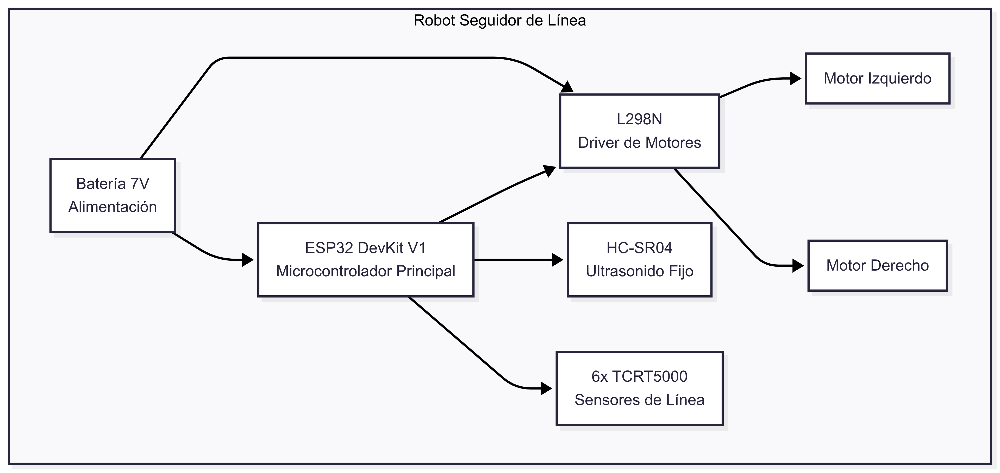

**Conexiones del Sistema:**

| Componente | Pines ESP32            | Función                 |
| ---------- | ---------------------- | ----------------------- |
| L298N      | 14, 27, 26, 12, 25, 33 | Control de motores      |
| HC-SR04    | 5 (TRIG), 4 (ECHO)     | Detección de obstáculos |
| TCRT5000   | 36, 39, 34, 35, 32, 23 | Sensores de línea       |

---

## 🕐 HORA 1: Configuración del Entorno de Desarrollo

### 1.1 Instalación de Visual Studio Code (15 min)

1. Descargar VS Code desde https://code.visualstudio.com/
2. Instalar con configuración por defecto
3. Abrir VS Code y familiarizarse con la interfaz

### 1.2 Instalación de PlatformIO (20 min)

1. Ir a Extensions (Ctrl+Shift+X)
2. Buscar "PlatformIO IDE"
3. Instalar la extensión oficial

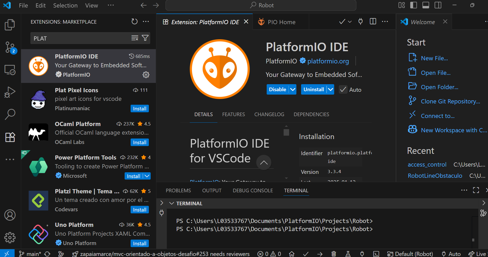

4. Reiniciar VS Code
5. Verificar que aparezca el icono de PlatformIO

### 1.3 Instalación de Gemini Code Assist (15 min)

1. Buscar "Gemini Code Assist" en Extensions
   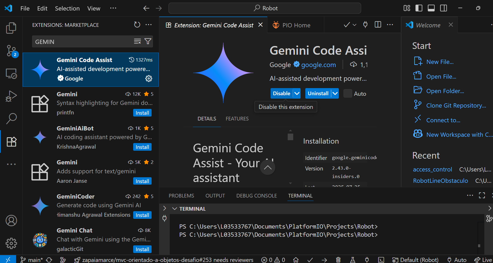
2. Instalar y configurar con cuenta de Google

3. Probar funcionalidad básica con comentarios
4. Modificar para el uso del modo agente (Ctrl+Shift+P)
   
5. Añadir esto al final del archio json
   . "geminicodeassist.inlineSuggestions.enableAuto": true,
   . "geminicodeassist.updateChannel": "Insiders"
6. Reiniciar VS Code

### 1.4 Crear Proyecto del Robot (10 min)

```bash
# Crear nuevo proyecto PlatformIO
1. Click en PlatformIO Home
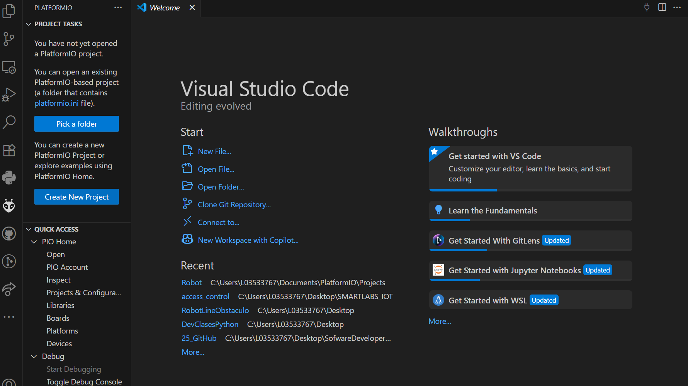
2. New Project
3. Name: robot_seguidor_linea
4. Board: DOIT ESP32 DEVKIT V1
5. Framework: Arduino
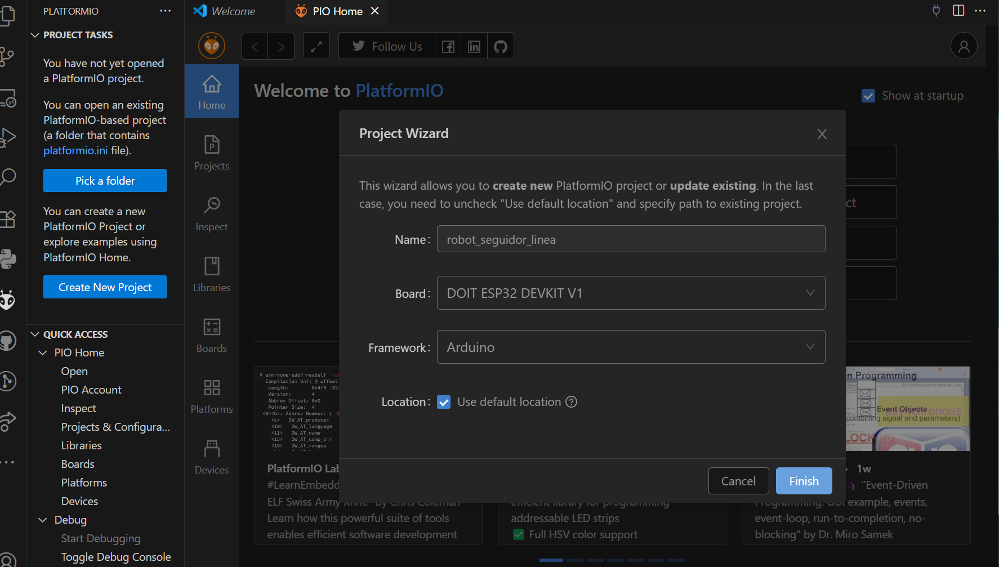
6. Location: Seleccionar carpeta
```

**Ejercicio Práctico**: Crear la estructura de carpetas y archivos base del proyecto.

---

## 🕑 HORA 2: Configuración Inicial y Pruebas Básicas

### 2.1 Configuración del Proyecto (15 min)

1. Crear estructura de archivos:

   - `src/main.cpp`
   - `src/config.h`
   - `src/config.cpp`
   - `src/motores.h`
   - `src/motores.cpp`

2. Configurar `platformio.ini`:

```ini
[env:esp32dev]
platform = espressif32
board = esp32dev
framework = arduino
lib_deps =
    teckel12/NewPing@^1.9.7
monitor_speed = 115200
```

Instalar libreria NewPing

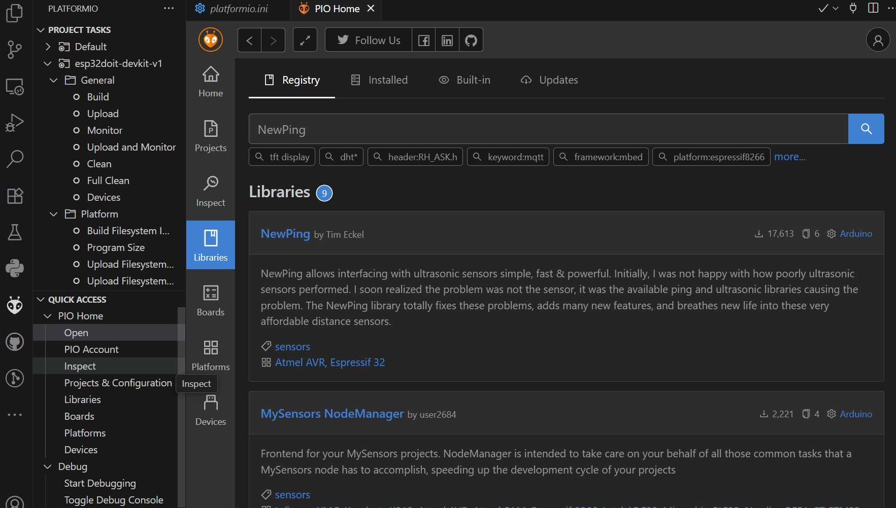

Añadir libreria NewPing

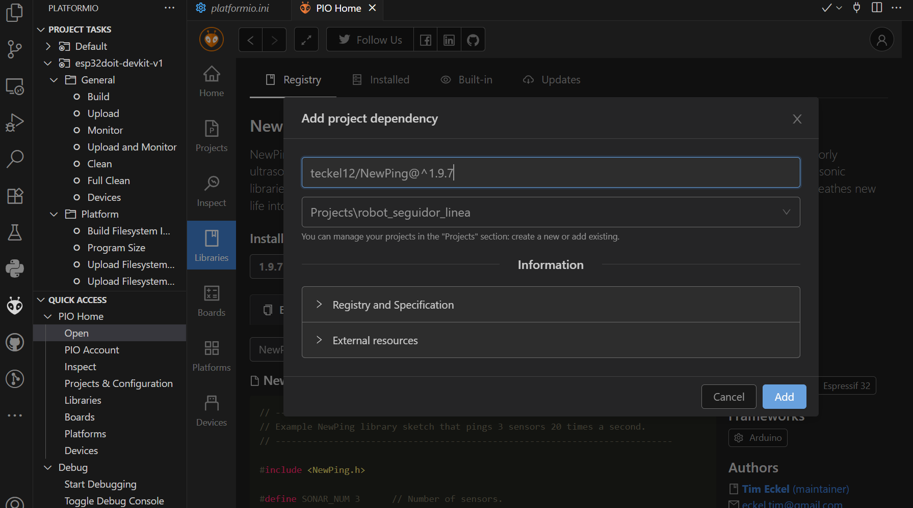

### Instalar Driver del ESP32

CP210x Controlador universal:
https://www.silabs.com/software-and-tools/usb-to-uart-bridge-vcp-drivers?tab=downloads

CH340C Controlador:
https://www.wch.cn/downloads/CH341SER_ZIP.html

### 2.2 Prueba de Conexión ESP32 (15 min)

```cpp
// Código de prueba básico
#include <Arduino.h>

void setup() {
    Serial.begin(115200);
    Serial.println("ESP32 Robot - Prueba de conexión");
}

void loop() {
    Serial.println("Sistema funcionando...");
    delay(1000);
}
```

### 2.3 Diagrama de Pines del ESP32

```
                    ESP32 DevKit V1
                 ┌─────────────────────┐
                 │                     │
    3V3    ●─────┤ 3V3           VIN   ├─────● VIN
    GND    ●─────┤ GND           GND   ├─────● GND
           ●─────┤ GPIO15       GPIO13├─────●
           ●─────┤ GPIO2        GPIO12├─────● ENB (12)
    ECHO   ●─────┤ GPIO4        GPIO14├─────● ENA (14)
           ●─────┤ GPIO16       GPIO27├─────● IN1 (27)
           ●─────┤ GPIO17       GPIO26├─────● IN2 (26)
    TRIG   ●─────┤ GPIO5        GPIO25├─────● IN3 (25)
           ●─────┤ GPIO18       GPIO33├─────● IN4 (33)
           ●─────┤ GPIO19       GPIO32├─────● S4 (32)
           ●─────┤ GPIO21       GPIO35├─────● S3 (35)
           ●─────┤ GPIO22       GPIO34├─────● S2 (34)
    S5     ●─────┤ GPIO23       GPIO39├─────● S1 (39)
           ●─────┤ GND          GPIO36├─────● S0 (36)
                 │                     │
                 └─────────────────────┘

Asignación de Pines:
┌─────────────┬─────────┬──────────────────────┐
│ Función     │ GPIO    │ Descripción          │
├─────────────┼─────────┼──────────────────────┤
│ Ultrasonido │ GPIO4   │ Echo (Entrada)       │
│             │ GPIO5   │ Trigger (Salida)     │
├─────────────┼─────────┼──────────────────────┤
│ L298N       │ GPIO14  │ ENA (Motor Izq PWM)  │
│ Motores     │ GPIO27  │ IN1 (Motor Izq Dir1) │
│             │ GPIO26  │ IN2 (Motor Izq Dir2) │
│             │ GPIO12  │ ENB (Motor Der PWM)  │
│             │ GPIO25  │ IN3 (Motor Der Dir1) │
│             │ GPIO33  │ IN4 (Motor Der Dir2) │
├─────────────┼─────────┼──────────────────────┤
│ Sensores    │ GPIO36  │ S0 (Izquierda)       │
│ de Línea    │ GPIO39  │ S1                   │
│ TCRT5000    │ GPIO34  │ S2                   │
│             │ GPIO35  │ S3                   │
│             │ GPIO32  │ S4                   │
│             │ GPIO23  │ S5 (Derecha)         │
└─────────────┴─────────┴──────────────────────┘
```

**Tabla de Asignación de Pines:**

| Función               | GPIO   | Descripción         |
| --------------------- | ------ | ------------------- |
| **Ultrasonido**       |
| Echo                  | GPIO4  | Entrada de señal    |
| Trigger               | GPIO5  | Salida de pulso     |
| **L298N Motores**     |
| ENA                   | GPIO14 | PWM Motor Izquierdo |
| IN1                   | GPIO27 | Dirección Motor Izq |
| IN2                   | GPIO26 | Dirección Motor Izq |
| ENB                   | GPIO12 | PWM Motor Derecho   |
| IN3                   | GPIO25 | Dirección Motor Der |
| IN4                   | GPIO33 | Dirección Motor Der |
| **Sensores TCRT5000** |
| S0                    | GPIO36 | Sensor Izquierda    |
| S1                    | GPIO39 | Sensor Izq-Centro   |
| S2                    | GPIO34 | Sensor Centro-Izq   |
| S3                    | GPIO35 | Sensor Centro-Der   |
| S4                    | GPIO32 | Sensor Derecha      |
| S5                    | GPIO23 | Sensor Extremo Der  |

### 2.4 Implementación del Archivo config.h (15 min)

```cpp
#ifndef CONFIG_H
#define CONFIG_H

#include <NewPing.h>
#include <vector>

// Definición de pines
#define TRIG_PIN 5
#define ECHO_PIN 4

// Pines del L298N
#define ENA 14
#define IN1 27
#define IN2 26
#define ENB 12
#define IN3 25
#define IN4 33

// Constantes
#define MAX_DISTANCE 200
#define OBSTACLE_THRESHOLD 20
#define BASE_SPEED 150

// Estados de la máquina
enum Estado {
    SEGUIR_LINEA,
    ESQUIVAR_OBSTACULO,
    BUSCAR_LINEA
};

extern Estado estadoActual;
extern NewPing sonar;

#endif
```

### 2.5 Prueba de Motores (15 min)

**Ejercicio**: Implementar funciones básicas de movimiento y probar cada motor individualmente.

---

## 🕒 HORA 3: Implementación del Control de Motores

### 3.1 Desarrollo de motores.cpp (20 min)

```cpp
#include "config.h"
#include "motores.h"

void setupMotores() {
    pinMode(ENA, OUTPUT);
    pinMode(IN1, OUTPUT);
    pinMode(IN2, OUTPUT);
    pinMode(ENB, OUTPUT);
    pinMode(IN3, OUTPUT);
    pinMode(IN4, OUTPUT);

    Serial.println("Motores configurados");
}

void moverMotores(int velocidadIzq, int velocidadDer) {
    // Motor izquierdo
    if (velocidadIzq > 0) {
        digitalWrite(IN1, HIGH);
        digitalWrite(IN2, LOW);
    } else {
        digitalWrite(IN1, LOW);
        digitalWrite(IN2, HIGH);
        velocidadIzq = -velocidadIzq;
    }
    analogWrite(ENA, velocidadIzq);

    // Motor derecho
    if (velocidadDer > 0) {
        digitalWrite(IN3, HIGH);
        digitalWrite(IN4, LOW);
    } else {
        digitalWrite(IN3, LOW);
        digitalWrite(IN4, HIGH);
        velocidadDer = -velocidadDer;
    }
    analogWrite(ENB, velocidadDer);
}

void detenerMotores() {
    digitalWrite(IN1, LOW);
    digitalWrite(IN2, LOW);
    digitalWrite(IN3, LOW);
    digitalWrite(IN4, LOW);
    analogWrite(ENA, 0);
    analogWrite(ENB, 0);
}
```

### 3.2 Pruebas de Movimiento (25 min)

**Ejercicios Prácticos**:

1. **Prueba 1**: Movimiento hacia adelante 2 segundos
2. **Prueba 2**: Giros izquierda y derecha
3. **Prueba 3**: Movimiento en cuadrado
4. **Prueba 4**: Calibración de velocidades

### 3.3 Depuración y Ajustes (15 min)

- Verificar dirección de rotación
- Ajustar velocidades si es necesario
- Calibrar diferencias entre motores

---

## 🕓 HORA 4: Sensores de Línea y Control PD

### 4.1 Configuración de Sensores TCRT5000 (20 min)

```cpp
// En config.h - agregar
#define SENSOR_0 36
#define SENSOR_1 39
#define SENSOR_2 34
#define SENSOR_3 35
#define SENSOR_4 32
#define SENSOR_5 23

extern int sensorPins[6];
extern int sensorWeights[6];
extern bool sensorValues[6];
```

### 4.2 Diagrama de Posicionamiento de Sensores

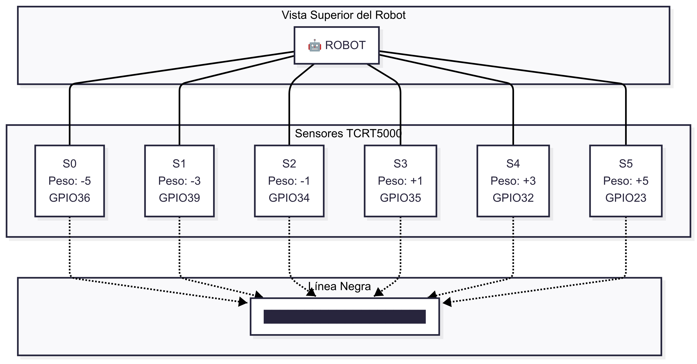

**Tabla de Configuración de Sensores:**

| Sensor | GPIO | Posición          | Peso | Función                     |
| ------ | ---- | ----------------- | ---- | --------------------------- |
| S0     | 36   | Extremo Izquierdo | -5   | Detección lateral izquierda |
| S1     | 39   | Izquierda         | -3   | Corrección izquierda        |
| S2     | 34   | Centro-Izquierda  | -1   | Centrado fino izquierda     |
| S3     | 35   | Centro-Derecha    | +1   | Centrado fino derecha       |
| S4     | 32   | Derecha           | +3   | Corrección derecha          |
| S5     | 23   | Extremo Derecho   | +5   | Detección lateral derecha   |

**Cálculo del Centroide:**

```
Centroide = Σ(Sensor_i × Peso_i) / Σ(Sensor_i)
```

**Ejemplos de Detección:**

| Sensores Activos | Centroide | Acción                 |
| ---------------- | --------- | ---------------------- |
| S2               | -1        | Robot centrado         |
| S1, S2           | -2        | Giro suave derecha     |
| S2, S3           | 0         | Perfectamente centrado |
| S3, S4           | +2        | Giro suave izquierda   |
| S0               | -5        | Giro fuerte derecha    |
| S5               | +5        | Giro fuerte izquierda  |

### 4.3 Implementación de sensores_linea.cpp (25 min)

```cpp
#include "config.h"
#include "sensores_linea.h"

void setupSensoresLinea() {
    for (int i = 0; i < 6; i++) {
        pinMode(sensorPins[i], INPUT);
    }
    Serial.println("Sensores de línea configurados");
}

void leerSensores() {
    for (int i = 0; i < 6; i++) {
        sensorValues[i] = digitalRead(sensorPins[i]);
    }
}

void mostrarSensores() {
    Serial.print("Sensores: ");
    for (int i = 0; i < 6; i++) {
        Serial.print(sensorValues[i]);
        Serial.print(" ");
    }
    Serial.println();
}
```

### 4.4 Pruebas de Sensores (15 min)

**Ejercicios**:

1. **Prueba 1**: Lectura individual de cada sensor
2. **Prueba 2**: Detección de línea negra
3. **Prueba 3**: Respuesta en diferentes posiciones

---

## 🕔 HORA 5: Implementación del Control PD

### 5.1 Diagrama del Sistema de Control PD

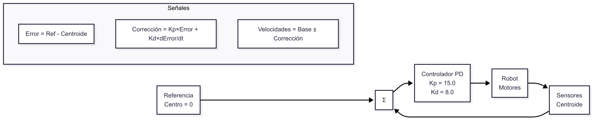

**Parámetros del Control PD:**

| Parámetro  | Valor | Función                            |
| ---------- | ----- | ---------------------------------- |
| Kp         | 15.0  | Respuesta proporcional (velocidad) |
| Kd         | 8.0   | Respuesta derivativa (estabilidad) |
| BASE_SPEED | 150   | Velocidad base de avance           |
| Referencia | 0     | Centro de la línea                 |

### 5.2 Implementación del Cálculo de Centroide (20 min)

```cpp
int calcularCentroide() {
    int suma = 0;
    int count = 0;

    for (int i = 0; i < 6; i++) {
        if (sensorValues[i]) {
            suma += sensorWeights[i];
            count++;
        }
    }

    if (count == 0) {
        return obtenerPromedioStack();
    }

    agregarAlStack(suma);
    return suma;
}
```

### 5.3 Implementación del Control PD (25 min)

```cpp
void controlPD(int centroide) {
    unsigned long currentTime = millis();
    float deltaTime = (currentTime - previousTime) / 1000.0;

    float error = 0 - centroide;
    float derivative = (error - previousError) / deltaTime;

    float output = Kp * error + Kd * derivative;

    int baseSpeed = BASE_SPEED;
    int leftSpeed = baseSpeed + output;
    int rightSpeed = baseSpeed - output;

    leftSpeed = constrain(leftSpeed, 0, 255);
    rightSpeed = constrain(rightSpeed, 0, 255);

    // Control de histéresis
    if (error >= 20) {
        moverMotores(0, 200);
    } else if (error <= -20) {
        moverMotores(200, 0);
    } else {
        moverMotores(leftSpeed, rightSpeed);
    }

    previousError = error;
    previousTime = currentTime;
}
```

**Ejercicios Prácticos**:

1. **Calibración de Kp**: Ajustar respuesta proporcional
2. **Calibración de Kd**: Ajustar respuesta derivativa
3. **Prueba en línea recta**: Verificar seguimiento
4. **Prueba en curvas**: Verificar estabilidad

---

## 🕕 HORA 6: Detección de Obstáculos y Máquina de Estados

### 6.1 Configuración del Sensor Ultrasónico (15 min)

```cpp
// En config.cpp
NewPing sonar(TRIG_PIN, ECHO_PIN, MAX_DISTANCE);
```

### 6.2 Diagrama del Sistema de Detección Ultrasónica


**Ventajas del Sistema Fijo:**

- ✅ Detección inmediata (sin delays de servo)
- ✅ Mayor velocidad de respuesta
- ✅ Menor complejidad de código
- ✅ Menor consumo energético
- ✅ Mayor confiabilidad

### 6.3 Implementación de Detección de Obstáculos (20 min)

```cpp
void setupObstaculos() {
    Serial.println("Sistema de obstáculos configurado - Ultrasonido fijo");
}

bool hayObstaculo() {
    int distance = sonar.ping_cm();
    if (distance == 0) distance = MAX_DISTANCE;

    Serial.print("Distancia: ");
    Serial.print(distance);
    Serial.println(" cm");

    return distance <= OBSTACLE_THRESHOLD;
}
```

### 6.4 Diagrama de la Rutina de Esquive

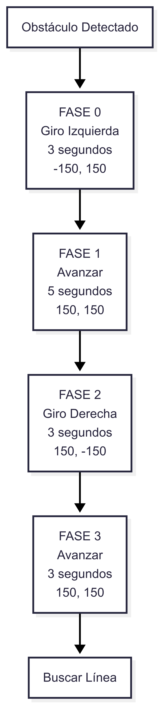

**Tabla de Parámetros de Esquive:**

| Fase | Acción   | Duración | Motor Izq | Motor Der | Descripción               |
| ---- | -------- | -------- | --------- | --------- | ------------------------- |
| 0    | Giro Izq | 3 seg    | -150      | 150       | Alejarse del obstáculo    |
| 1    | Avanzar  | 5 seg    | 150       | 150       | Rodear el obstáculo       |
| 2    | Giro Der | 3 seg    | 150       | -150      | Orientarse hacia la línea |
| 3    | Avanzar  | 3 seg    | 150       | 150       | Retornar a la línea       |

### 6.5 Implementación de la Rutina de Esquive (15 min)

```cpp
void esquivarObstaculo() {
  unsigned long tiempoActual = millis();

  switch (faseEsquivar) {
    case 0: // Giro a la izquierda por 3 segundos
      if (tiempoActual - tiempoEsquivar < 3000) {
        moverMotores(-150, 150);
      } else {
        faseEsquivar = 1;
        tiempoEsquivar = tiempoActual;
      }
      break;

    case 1: // Adelante por 5 segundos
      if (tiempoActual - tiempoEsquivar < 5000) {
        moverMotores(150, 150);
      } else {
        faseEsquivar = 2;
        tiempoEsquivar = tiempoActual;
      }
      break;

    case 2: // Giro a la derecha por 3 segundos
      if (tiempoActual - tiempoEsquivar < 3000) {
        moverMotores(150, -150);
      } else {
        faseEsquivar = 3;
        tiempoEsquivar = tiempoActual;
      }
      break;

    case 3: // Adelante por 10 segundos
      if (tiempoActual - tiempoEsquivar < 10000) {
        moverMotores(150, 150);
      } else {
        faseEsquivar = 4;
        tiempoEsquivar = tiempoActual;
      }
      break;

    case 4: // Giro a la derecha por 3 segundos
      if (tiempoActual - tiempoEsquivar < 3000) {
        moverMotores(150, -150);
      } else {
        estadoActual = BUSCAR_LINEA;
        faseEsquivar = 0;
      }
      break;
  }
}
```

### 6.6 Máquina de Estados del Robot

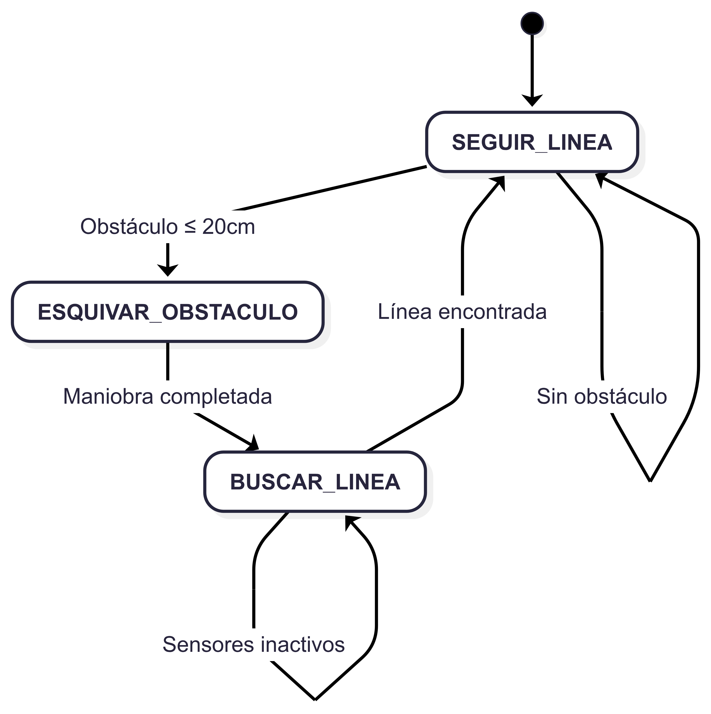

**Condiciones de Transición:**

| Estado Actual      | Condición         | Estado Siguiente   |
| ------------------ | ----------------- | ------------------ |
| SEGUIR_LINEA       | Sin obstáculo     | SEGUIR_LINEA       |
| SEGUIR_LINEA       | Obstáculo ≤ 20cm  | ESQUIVAR_OBSTACULO |
| ESQUIVAR_OBSTACULO | Maniobra completa | BUSCAR_LINEA       |
| BUSCAR_LINEA       | Línea detectada   | SEGUIR_LINEA       |

### 6.7 Integración Final y Máquina de Estados (10 min)

```cpp
void loop() {
    leerSensores();

    switch (estadoActual) {
        case SEGUIR_LINEA:
            if (hayObstaculo()) {
                estadoActual = ESQUIVAR_OBSTACULO;
                tiempoEsquivar = millis();
                faseEsquivar = 0;
            } else {
                int centroide = calcularCentroide();
                controlPD(centroide);
            }
            break;

        case ESQUIVAR_OBSTACULO:
            esquivarObstaculo();
            break;

        case BUSCAR_LINEA:
            if (buscarLinea()) {
                estadoActual = SEGUIR_LINEA;
            } else {
                moverMotores(100, 100);
            }
            break;
    }

    delay(50);
}
```

---

## 📊 Diagramas de Referencia Adicionales

### 🔧 Diagrama de Conexiones Hardware

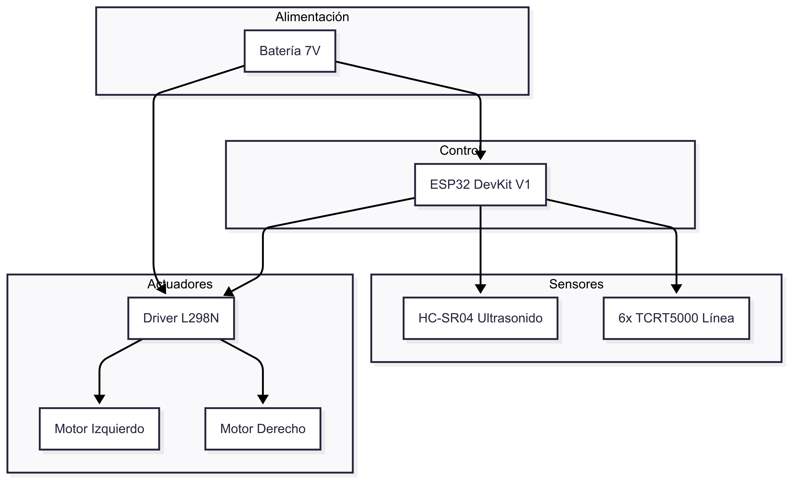

### 🔄 Diagrama de Flujo Principal

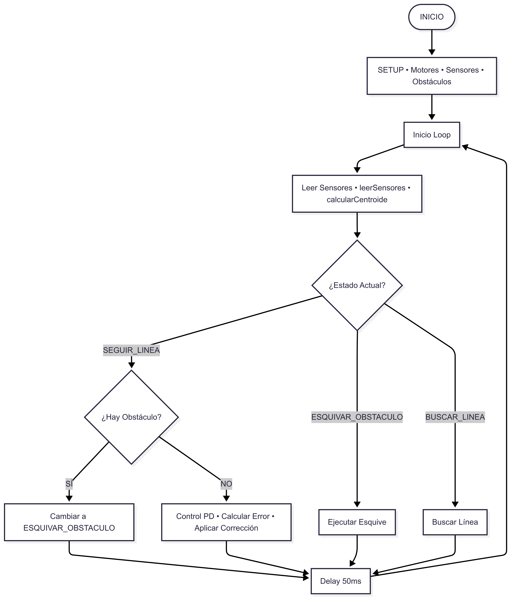

---

## 🎯 Ejercicios Prácticos Finales

### Ejercicio 1: Calibración Completa (15 min)

1. Ajustar umbral de detección de obstáculos
2. Calibrar parámetros Kp y Kd
3. Optimizar velocidades de esquive

### Ejercicio 2: Prueba Integral (15 min)

1. Probar en circuito con línea y obstáculos
2. Verificar transiciones entre estados
3. Ajustar tiempos de maniobra

### Ejercicio 3: Depuración y Optimización (15 min)

1. Usar Serial Monitor para depuración
2. Identificar y corregir problemas
3. Documentar parámetros finales

---

## 📚 Recursos Adicionales

### Comandos Útiles de PlatformIO

```bash
# Compilar proyecto
pio run

# Subir código
pio run --target upload

# Monitor serial
pio device monitor

# Limpiar build
pio run --target clean
```

### Herramientas de Depuración

- **Serial Monitor**: Monitoreo en tiempo real
- **Gemini Code Assist**: Sugerencias de código
- **Breakpoints**: Pausar ejecución (simulación)

### Parámetros de Configuración Recomendados

```cpp
// Control PD
float Kp = 2.0;        // Respuesta proporcional
float Kd = 1.0;        // Respuesta derivativa
int BASE_SPEED = 150;  // Velocidad base

// Detección (Ultrasonido fijo)
int OBSTACLE_THRESHOLD = 20;  // Distancia de detección en cm
int MAX_DISTANCE = 200;       // Rango máximo sensor
```

---

## ✅ Checklist de Finalización

### Configuración Completada

- [ ] VS Code instalado y configurado
- [ ] PlatformIO funcional
- [ ] Gemini Code Assist activo
- [ ] Proyecto creado correctamente

### Funcionalidades Implementadas

- [ ] Control de motores funcional
- [ ] Sensores de línea calibrados
- [ ] Control PD implementado
- [ ] Detección de obstáculos con ultrasonido fijo
- [ ] Rutina de esquive funcional
- [ ] Máquina de estados operativa

### Pruebas Realizadas

- [ ] Movimiento básico de motores
- [ ] Seguimiento de línea recta
- [ ] Seguimiento en curvas
- [ ] Detección de obstáculos
- [ ] Esquive completo
- [ ] Retorno a línea

---

## 🔧 Troubleshooting Común

### Problema: ESP32 no se detecta

**Solución**:

1. Verificar cable USB
2. Instalar drivers CP210x
3. Presionar botón BOOT al cargar

### Problema: Motores no giran

**Solución**:

1. Verificar conexiones L298N
2. Comprobar alimentación
3. Revisar lógica de control

### Problema: Sensores no detectan línea

**Solución**:

1. Ajustar altura sensores
2. Calibrar umbral de detección
3. Verificar conexión con microcontrolador
